# 📱 HELLO HATHRAS — PHASE 1: MVP EXECUTION PLAN
### Lean, Optimized & Ready for Immediate Approval
**Prepared by:** Shivam Gupta (Lead Developer)  
**For:** District Magistrate Office, Hathras (Shri Atul Vats, IAS)  
**Via:** Parth Maheshwari  
**Date:** April 2, 2026  
**Version:** 1.0 — Phase 1 Focused Edition  
**Document Type:** Phase 1 Detailed Execution Blueprint for DM Approval

---

## 📋 TABLE OF CONTENTS

1. [Phase 1 Executive Summary](#1-phase-1-executive-summary)
2. [Why Phase 1 First — The Lean Approach](#2-why-phase-1-first--the-lean-approach)
3. [Problem Statement — What Citizens Face Today](#3-problem-statement--what-citizens-face-today)
4. [Phase 1 Scope — Included vs Deferred](#4-phase-1-scope--included-vs-deferred)
5. [Phase 1 Solution — What Gets Delivered](#5-phase-1-solution--what-gets-delivered)
6. [Module-Wise Feature Specification (Phase 1)](#6-module-wise-feature-specification-phase-1)
7. [App Design Preview — All Screens](#7-app-design-preview--all-screens)
8. [Technology Stack — Phase 1](#8-technology-stack--phase-1)
9. [System Architecture & Design](#9-system-architecture--design)
10. [Admin Panel — Phase 1 Scope](#10-admin-panel--phase-1-scope)
11. [Government Compliance & Security](#11-government-compliance--security)
12. [Phase 1 Optimized Budget & Quotation](#12-phase-1-optimized-budget--quotation)
13. [Phase 1 Timeline — 16 Weeks](#13-phase-1-timeline--16-weeks)
14. [Payment Milestone Schedule](#14-payment-milestone-schedule)
15. [Risk Assessment & Mitigation](#15-risk-assessment--mitigation)
16. [Success Metrics & KPIs](#16-success-metrics--kpis)
17. [Post Phase 1 — What Comes Next](#17-post-phase-1--what-comes-next)
18. [Cost-Benefit Analysis for DM](#18-cost-benefit-analysis-for-dm)
19. [Why This Proposal Deserves Approval](#19-why-this-proposal-deserves-approval)
20. [Appendix](#20-appendix)

---

## 1. PHASE 1 EXECUTIVE SUMMARY

### 🎯 One-Line Vision
> **"Hello Hathras" — Ek App, Poora Hathras.** A single mobile platform bringing every district service, alert, scheme, directory, and government update to citizens' fingertips.

### 📌 What is Phase 1?
Phase 1 is the **Minimum Viable Product (MVP)** — a fully functional Android application delivering the **most critical and high-impact features** to citizens while keeping costs minimal and delivery fast.

### Phase 1 At a Glance

| Parameter | Details |
|-----------|---------|
| **Platform** | Android (APK sideloading + Google Play Store) |
| **Duration** | 16 weeks (4 months) |
| **Budget** | ₹4,50,000 – ₹5,50,000 (excl. GST) |
| **Citizens Served** | 15,64,708 (entire Hathras district) |
| **Cost Per Citizen** | < ₹0.37 |
| **Total App Screens** | 27 screens across 13+ modules |
| **Developer** | Shivam Gupta (Full-stack — Flutter + Backend + Admin Panel) |
| **Infrastructure Cost** | Near-zero (Firebase free tier) |
| **Year 1 Maintenance** | Included in project cost |

### ✅ Phase 1 Delivers

| Deliverable | Description |
|-------------|-------------|
| Android Mobile App | 27 screens, 13+ modules — native Flutter app |
| Admin Panel | React.js web dashboard for DM office content management |
| Push Notifications | Real-time emergency alerts to all citizens via FCM |
| District Directory | Every office, hospital, police station, school — click-to-call + maps |
| Emergency SOS | One-tap call to Police (100), Ambulance (108), Fire (101), Helplines |
| Scheme Navigator | Eligibility, documents, apply links for all government schemes |
| Citizen Services | Certificates, land records, ration card — quick portal links |
| News & Alerts | Live feed from district administration with push alerts |
| Tourism Module | Dauji Temple, Manglaytan, Ghanta Ghar — photos, maps, accommodation |
| Offline Support | Directory & helplines work without internet |
| Bilingual | Full Hindi + English support |
| Backend API | Node.js/Firebase — secure, scalable, free-tier hosted |

### ❌ Deferred to Later Phases

| Feature | Phase | Reason |
|---------|-------|--------|
| AI Chatbot (Hindi/English) | Phase 2 | Requires Gemini API, higher recurring cost |
| iOS App | Phase 2 | Apple Developer Account + testing |
| Bhashini NLP Integration | Phase 2 | Depends on AI module |
| Blood Donor Directory | Phase 3 | Nice-to-have, not critical for MVP |
| STQC Audit | Phase 3 | Government certification process |
| NIC/MeghRaj Cloud Migration | Phase 3 | Government infrastructure process |
| Security Audit (VAPT) | Phase 3 | Formal third-party audit |
| Advanced DM Analytics Dashboard | Phase 3 | Advanced reporting & export |

---

## 2. WHY PHASE 1 FIRST — THE LEAN APPROACH

### The Government Approval Reality
Government projects go through multiple phases of approvals. A lean Phase 1 approach offers strategic advantages:

| Parameter | Traditional Full-Project Approach | Our Lean Phase 1 Approach |
|-----------|----------------------------------|--------------------------|
| **Upfront Cost** | ₹16–20 Lakhs | ₹4.5–5.5 Lakhs |
| **Time to First Delivery** | 10+ months | 4 months |
| **Financial Risk** | High — large upfront commitment | Minimal — prove concept first |
| **Approval Complexity** | Complex — large budget justification | Easier — smaller budget |
| **Feature Delivery** | All at once (overwhelming) | Core first, add based on feedback |
| **ROI Justification** | Difficult upfront | Quick citizen impact = clear ROI |
| **Failure Recovery** | Costly — large sunk cost | Minimal — small investment |

### How Phasing Keeps Costs Minimal

```
PHASE 1 (NOW)           ₹4.5–5.5L    ——►  Working Android App + Admin Panel
         ↓
    [PROVE VALUE — citizen adoption, DM feedback]
         ↓
PHASE 2 (3 months later) ₹4.4–4.9L   ——►  AI Chatbot + iOS + Enhancements
         ↓
    [DEMONSTRATE SCALE — usage metrics, impact data]
         ↓
PHASE 3 (3 months later) ₹4.9–8.1L   ——►  Full Compliance + Audit + Scale
```

### Benefits of Phased Approach

| # | Benefit | Impact |
|---|---------|--------|
| 1 | Lower approval threshold | ₹5.5L is far easier to approve than ₹18L |
| 2 | Proof of concept | Working app justifies Phase 2 funding |
| 3 | Real citizen feedback | Usage data guides what to build next |
| 4 | Political flexibility | Phase 1 delivered regardless of admin changes |
| 5 | Scalable model | Success in Hathras = template for other districts |

---

## 3. PROBLEM STATEMENT — WHAT CITIZENS FACE TODAY

### Current Situation

| Aspect | Current Status |
|--------|---------------|
| **District Website** | hathras.nic.in exists — desktop-focused, not mobile-optimized |
| **Existing App** | Old Hello-Hathras APK (lachhan.com) — outdated, non-functional |
| **Citizen Internet Access** | 80%+ via mobile phones |
| **Official Mobile Channel** | None — no direct way for DM office to reach citizens on mobile |
| **Website Platform** | WordPress/PHP/MySQL on NIC S3WAAS — not designed for mobile |

### Problems Phase 1 Solves

| # | Problem | Impact on Citizens | Phase 1 Solution |
|---|---------|-------------------|------------------|
| 1 | No district-specific mobile app | Citizens scattered across WhatsApp for updates | ✅ Official Hello Hathras app |
| 2 | Emergency alerts don't reach everyone | Lives at risk during disasters, heatwaves | ✅ Push notifications via FCM |
| 3 | Citizens don't know which office to visit | Wasted time, frustration, multiple trips | ✅ Complete directory with maps & call |
| 4 | Scheme eligibility rules are confusing | Eligible citizens miss government benefits | ✅ Scheme navigator with eligibility checker |
| 5 | Citizens depend on middlemen | Corruption, delays, misinformation | ✅ Direct info with documents & portal links |
| 6 | Emergency numbers not readily available | Delay in critical life-threatening situations | ✅ One-tap Emergency SOS |
| 7 | Rumours spread on social media | Panic, misinformation during emergencies | ✅ Official verified news channel |
| 8 | No real-time complaint tracking | Citizens feel unheard by administration | ✅ CM Jansunwai deep link integration |
| 9 | Tourism info not easily accessible | Missed tourism revenue for district | ✅ Tourism module with maps & photos |

---

## 4. PHASE 1 SCOPE — INCLUDED vs DEFERRED

### ✅ INCLUDED IN PHASE 1 (MVP)

| # | Module | Status | Priority | Screens |
|---|--------|--------|----------|---------|
| 1 | Home Screen (Banner, Grid, Feed, DM Card) | ✅ Full Build | P0 — Critical | 1 |
| 2 | Emergency SOS (One-tap call) | ✅ Full Build | P0 — Critical | 1 |
| 3 | District Directory (Offices, Officers, Utilities) | ✅ Full Build | P0 — Critical | 5 |
| 4 | Helpline Numbers (Click-to-call) | ✅ Full Build | P0 — Critical | — |
| 5 | Push Notifications (FCM) | ✅ Full Build | P0 — Critical | — |
| 6 | News & Alerts Feed | ✅ Full Build | P1 — High | 3 |
| 7 | Scheme Navigator | ✅ Full Build | P1 — High | 3 |
| 8 | Citizen Services (Quick links) | ✅ Full Build | P1 — High | 2 |
| 9 | Complaint Integration (Deep links) | ✅ Full Build | P1 — High | 2 |
| 10 | Offline Caching (Hive) | ✅ Full Build | P1 — High | — |
| 11 | Bilingual (Hindi/English) | ✅ Full Build | P1 — High | — |
| 12 | Tourism Module | ✅ Full Build | P2 — Medium | 3 |
| 13 | Documents Section (PDF viewer) | ✅ Full Build | P2 — Medium | 2 |
| 14 | Government Apps Hub | ✅ Full Build | P2 — Medium | 1 |
| 15 | Accessibility (Font, Contrast) | ✅ Full Build | P2 — Medium | — |
| 16 | Admin Panel (Web Dashboard) | ✅ Full Build | P0 — Critical | Web |
| 17 | Backend API (Node.js/Firebase) | ✅ Full Build | P0 — Critical | — |
| 18 | WebView Container | ✅ Full Build | P1 — High | 1 |
| 19 | Analytics (Firebase) | ✅ Full Build | P2 — Medium | — |
| 20 | Onboarding / Splash | ✅ Full Build | P2 — Medium | 2 |

### ❌ DEFERRED TO PHASE 2/3

| # | Feature | Deferred To | Reason for Deferral |
|---|---------|-------------|---------------------|
| 1 | AI Chatbot (Hindi/English) | Phase 2 | Requires Gemini API — higher recurring cost |
| 2 | iOS App (Apple App Store) | Phase 2 | Apple Developer Account + separate testing cycle |
| 3 | Bhashini NLP Integration | Phase 2 | Depends on AI chatbot module |
| 4 | Blood Donor Directory | Phase 3 | Community feature — not critical for MVP launch |
| 5 | STQC Audit & Certification | Phase 3 | Government process — requires working app first |
| 6 | NIC/MeghRaj Cloud Migration | Phase 3 | Government infrastructure — post-approval process |
| 7 | Security Audit (VAPT) | Phase 3 | Formal third-party audit — Phase 3 budget |
| 8 | Advanced DM Analytics Dashboard | Phase 3 | Advanced reporting with charts, exports, drill-down |

---

## 5. PHASE 1 SOLUTION — WHAT GETS DELIVERED

### 5.1 Mobile Application (Android)

| Component | Details |
|-----------|---------|
| **Framework** | Flutter 3.x (Dart) |
| **Total Screens** | 27 screens across 13+ modules |
| **Platform** | Android (APK + Google Play Store) |
| **Languages** | Hindi + English (full bilingual) |
| **Offline Mode** | Directory, Helplines, Schemes cached locally |
| **Push Notifications** | Firebase Cloud Messaging (unlimited, free) |
| **Maps** | Google Maps integration (free $200/mo credit) |
| **Analytics** | Firebase Analytics + Crashlytics |

### 5.2 Admin Panel (Web Dashboard)

| Feature | Description | Who Uses It |
|---------|-------------|-------------|
| Notice Manager | Post/Edit/Delete notices + push notification toggle | DM, Officers |
| Alert Manager | Send emergency alerts with priority levels (Red/Blue/Green) | DM, SP |
| Directory Manager | Add/Edit/Remove offices, officers, contact details, bulk CSV import | IT Cell, Nodal Officers |
| Scheme Manager | Manage eligibility criteria, required documents, apply links | Department Officers |
| Document Uploader | Upload PDFs, images, office orders — categorized | DM, Officers |
| User/Role Manager | Add/remove admin users, assign RBAC roles | Super Admin (IT/NIC) |
| Analytics Dashboard | App downloads, active users, popular sections, charts | DM |
| WordPress Sync | Auto-sync content from hathras.nic.in via REST API | IT Cell |

### 5.3 Backend Infrastructure

| Component | Technology | Phase 1 Cost |
|-----------|-----------|--------------|
| Database | Firebase Firestore (NoSQL, real-time) | ₹0 — Free tier |
| Authentication | JWT + Firebase Auth | ₹0 — Free tier |
| Push Notifications | Firebase Cloud Messaging (FCM) | ₹0 — Free unlimited |
| File Storage | Firebase Storage (PDFs, images) | ₹0 — Free tier (5GB) |
| API Server | Node.js + Express / Firebase Functions | ₹0 — Free tier |
| Analytics | Firebase Analytics | ₹0 — Free unlimited |
| Crash Reporting | Firebase Crashlytics | ₹0 — Free unlimited |
| CDN | Cloudflare (DNS, SSL, caching) | ₹0 — Free tier |
| CI/CD | GitHub Actions | ₹0 — Free tier |
| **Total Infrastructure** | | **₹0/month** (up to 50K MAU) |

---

## 6. MODULE-WISE FEATURE SPECIFICATION (PHASE 1)

### Module 1: Home Screen

| Feature | Description |
|---------|-------------|
| Banner Slider | DM message, key visuals — Dauji Temple, Ghanta Ghar, Manglaytan |
| Quick Action Grid | 8 icons: Alerts, Schemes, Directory, Complaint, Services, Tourism, Emergency, Apps Hub |
| Live Feed | Latest 5 news/notifications (scrollable) |
| District Stats | Area: 1,800.1 sq km · Population: 15,64,708 · Villages: 683 |
| DM Profile Card | Photo, name, designation, social links |

### Module 2: Emergency SOS (HIGH IMPACT)

| Helpline | Number | Type |
|----------|--------|------|
| UP Dial (Police) | 100 | 🔴 Emergency |
| Ambulance | 108 | 🔴 Emergency |
| Fire Service | 101 | 🔴 Emergency |
| Women Helpline | 1090 | 🟡 Safety |
| Women Ambulance | 102 | 🟡 Safety |
| Child Helpline | 1098 | 🟡 Safety  |
| CM Helpline | 1076 | 🔵 Government |
| Tele MANAS (Mental Health) | 14416 / 1800-891-4416 | 🔵 Health |
| Traffic Police | 103 | 🔵 General |

> All helplines work **offline** — stored locally in Hive database.

### Module 3: District Directory (CRITICAL MODULE)

| Directory Category | Entries | Features |
|--------------------|---------|----------|
| Government Offices (Collectorate, Tehsil, Blocks, Courts) | ~50 | 📞 Call + 🗺️ Maps |
| Police Stations | 11 | 📞 Call + 🗺️ Maps + Jurisdiction |
| Hospitals / CHC / PHC | 11 | 📞 Call + 🗺️ Maps |
| Banks | 22 | 📞 Call + 🗺️ Maps |
| Schools | 80 | 📞 Call + 🗺️ Maps |
| Colleges / Universities | 5 | 📞 Call + 🗺️ Maps |
| Other (Electricity, Post, Municipality, NGO) | 5 | 📞 Call + 🗺️ Maps |
| Who's Who Officers | ~30 | Photo + Designation + 📞 Call + ✉️ Email |

> **Key Features**: Search by name/department/area, click-to-call, click-to-navigate (Google Maps), filter by category, **offline access** for all directory data.

### Module 4: Scheme Navigator

| Feature | Description |
|---------|-------------|
| Scheme List | All UP/Central schemes — CM Kisan Bima, Pensions, Awaas Yojna, Health Protection, Ration Card |
| Scheme Card | Name (Hindi + English), Eligibility Criteria, Required Documents, Apply Link, Concerned Office, Nodal Officer, Last Date |
| Category Filters | Agriculture, Pension, Housing, Health, Education |
| District-Specific | UP-specific rules (e.g., widow pension criteria for Hathras) |

### Module 5: News & Alerts

| Feature | Description |
|---------|-------------|
| News Feed | Real-time district news from administration |
| Categories | General, Recruitment, Excise, Health, Education |
| Alert Types | 🔴 Emergency (red), 🔵 Info (blue), 🟢 Update (green) |
| Media Support | Text, image, PDF, video attachments |
| Push Notifications | Admin-triggered via FCM — instant delivery |
| Notification Center | In-app history of all notifications |

### Module 6: Citizen Services

| Service | Portal Integration |
|---------|-------------------|
| Birth / Death / Caste / Domicile Certificate | eSathi / eDistrict Portal |
| Land Records | UP Bhulekh (upbhulekh.gov.in) |
| Supply / Ration Card | FCS UP (fcs.up.nic.in) |
| Revenue Services | Revenue Department Portal |
| Social Security | Social Welfare Portal |
| UP Scholarship & Fee Reimbursement | Scholarship Portal |

> Each service shows: What it is, documents needed, where to apply, direct online portal link.

### Module 7: Complaint Integration

| Feature | Description |
|---------|-------------|
| CM Jansunwai | Deep link to jansunwai.up.nic.in |
| RTI Online | Deep link to rtionline.gov.in |
| Department Portals | Links to specific department complaint pages |
| Step-by-Step Guide | "How to file a complaint on CM Jansunwai" — with screenshots |
| Status Tracking | Direct links to check complaint status |

> **NOT a new complaint system** — uses existing government portals via deep links.

### Module 8: Tourism

| Place | Description |
|-------|-------------|
| Dauji Temple | Ancient Krishna temple — pilgrimage site |
| Manglaytan Teerthdham | Jain pilgrimage center |
| Ghanta Ghar | Historic clock tower — district landmark |
| Jain Temples | Heritage Jain religious sites |
| Historical Fort | District heritage site |

> **Features**: Photos, descriptions, Google Maps location, How to Reach (train/bus/road), Accommodation (Hotels, Resorts, Dharamsalas with contact).

### Module 9: Documents Section

| Category | Content Type |
|----------|-------------|
| Annual Report | PDF documents |
| Statistical Reports | PDF documents |
| Notifications | Official notifications |
| Disaster Management | Emergency plans & guidelines |
| Office Orders | Administrative orders |
| Guidelines | Government guidelines |

> **Features**: In-app PDF viewer, download, share via WhatsApp/email.

### Module 10: Government Apps Hub

| App | Purpose |
|-----|---------|
| UMANG | Unified government services |
| DigiLocker | Digital document storage |
| mAadhaar | Aadhaar on mobile |
| Bhashini | Indian language translation |
| Aarogya Setu | Health & COVID tracking |
| Parivahan | Vehicle & driving license |
| UP State Apps | State-specific applications |

> **Feature**: One-tap install (Play Store redirect) or open if already installed.

### Module 11–13: Supporting Modules

| Module | Features |
|--------|----------|
| **Settings & Profile** | Language toggle (Hindi ↔ English), Font size controls, Notification preferences, App version info |
| **WebView Container** | In-app browser for hathras.nic.in pages — seamless redirect without leaving app |
| **Onboarding / Splash** | Welcome screen, Permission requests (notification, location), Language selection |

### System-Level Features

| Feature | Technology | Description |
|---------|-----------|-------------|
| Push Notifications | Firebase Cloud Messaging | Topic-based subscriptions, foreground/background handling |
| Offline Caching | Hive (Local DB) | Directory, helplines, schemes cached — works without internet |
| Bilingual System | flutter_localizations | Complete Hindi/English for all ~200 strings |
| Accessibility | WCAG 2.1 AA | Font scaling, high contrast mode, screen reader (TalkBack) labels |
| Analytics | Firebase Analytics | Event tracking — screen views, button clicks, popular sections |

---

## 7. APP DESIGN PREVIEW — ALL SCREENS

> The following are the actual UI/UX designs for the Hello Hathras mobile application. These screens represent the proposed look and feel of the app across all major modules. Designs follow **Material Design** guidelines with official government color scheme matching hathras.nic.in.

---

#### 🏠 Screen 1: Home Screen
> The main landing screen with DM banner, district statistics (population, area, villages), quick service grid (Emergency SOS, CM Jansunwai, Schemes, Land Records, Services, Directory, Tourism, News), and latest updates feed.

<p align="center">
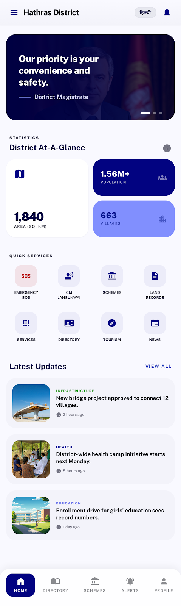
</p>

---

#### 🏠 Screen 2: Home Screen — AI Hub Popup
> Home screen with the floating AI Assistant hub activated, showing quick-access AI chatbot overlay for citizen queries in Hindi/English. *(AI Hub is a Phase 2 feature — shown here for future vision)*

<p align="center">
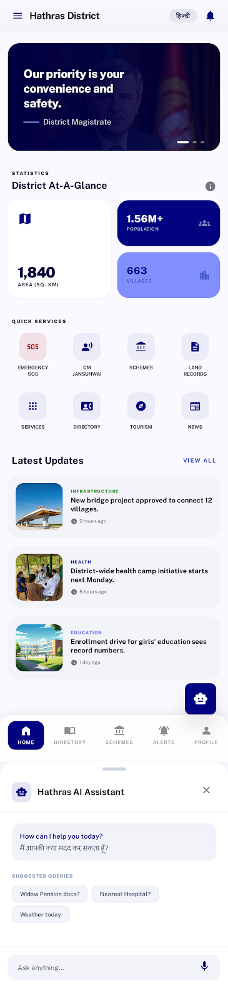
</p>

---

#### 📖 Screen 3: District Directory
> Complete directory of government offices, hospitals, police stations, banks, schools with click-to-call and click-to-navigate (Google Maps) functionality.

<p align="center">
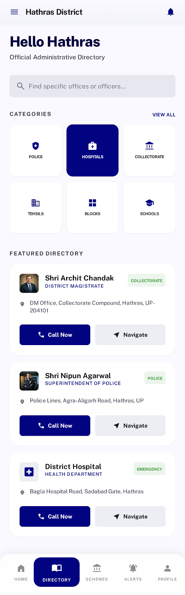
</p>

---

#### 📖 Screen 4: Directory — AI Hub Popup
> Directory screen with the AI Assistant overlay for searching offices and officers via natural language queries. *(Phase 2 feature preview)*

<p align="center">
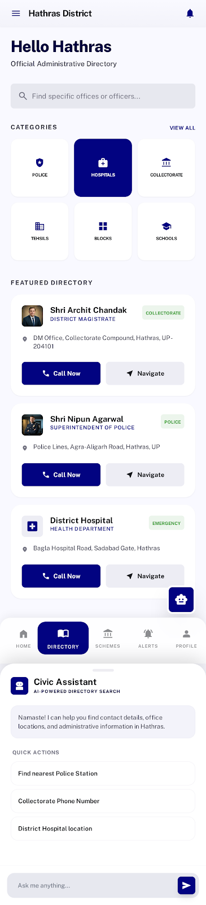
</p>

---

#### 📋 Screen 5: Scheme Navigator
> Government schemes listing with eligibility criteria, required documents, apply links, and nodal officer details. Filter by category: Agriculture, Pension, Housing, Health, Education.

<p align="center">
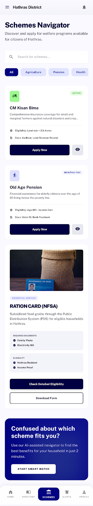
</p>

---

#### 📋 Screen 6: Schemes — AI Hub Popup
> Scheme navigator with AI chatbot overlay for asking scheme eligibility questions like "Widow pension ke liye kya documents chahiye?" *(Phase 2 feature preview)*

<p align="center">
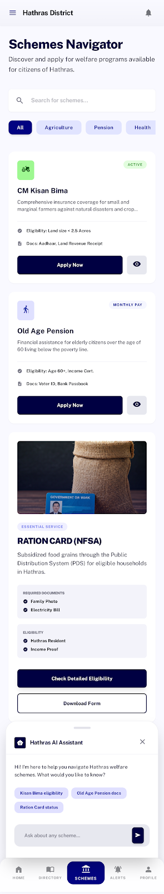
</p>

---

#### 📰 Screen 7: News & Alerts Feed
> Real-time news feed with categories (General, Recruitment, Health, Education), push notification support, and emergency alert highlights.

<p align="center">
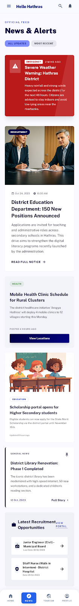
</p>

---

#### 📰 Screen 8: News Feed — AI Hub Popup
> News feed with AI Assistant overlay for querying latest district updates and announcements. *(Phase 2 feature preview)*

<p align="center">
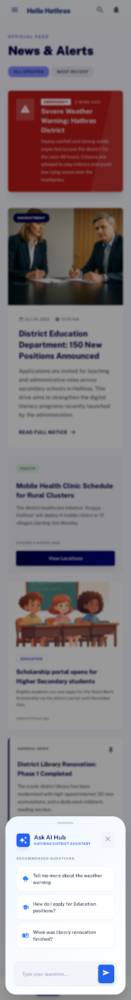
</p>

---

#### 🏛️ Screen 9: Tourism Guide
> Hathras tourism section featuring places of interest (Dauji Temple, Manglaytan Teerthdham, Ghanta Ghar), how to reach, and accommodation details with maps.

<p align="center">

</p>

---

#### 🏛️ Screen 10: Tourism Guide — AI Hub Popup
> Tourism screen with AI chatbot overlay for tourist queries like "How to reach Dauji Temple from railway station?" *(Phase 2 feature preview)*

<p align="center">
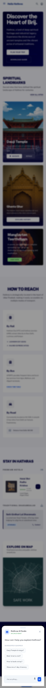
</p>

---

#### 🚨 Screen 11: Emergency SOS
> One-tap emergency panel with direct call buttons for Police (100), Ambulance (108), Fire (101), Women Helpline (1090), Child Helpline (1098), CM Helpline (1076), and Tele MANAS.

<p align="center">
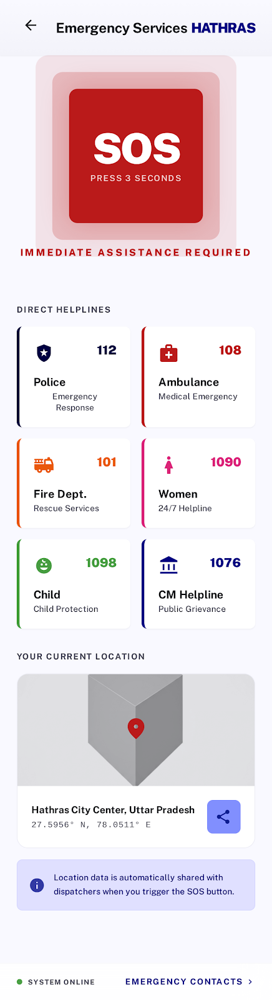
</p>

---

#### 🚨 Screen 12: Emergency SOS — AI Assistant
> Emergency screen with AI Assistant activated for guided emergency support and nearest facility finder. *(Phase 2 feature preview)*

<p align="center">
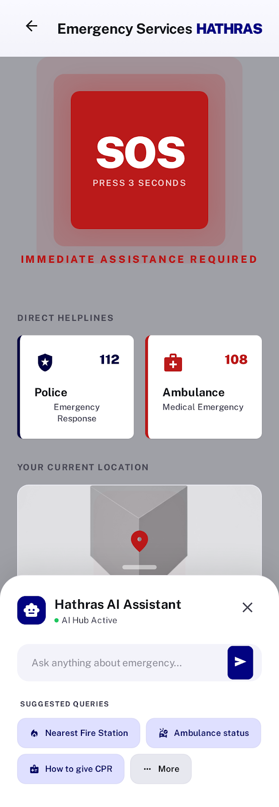
</p>

---

#### 👤 Screen 13: Profile & Government Apps Hub
> User profile section with government apps grid (UMANG, DigiLocker, mAadhaar, Bhashini, Aarogya Setu, Parivahan) — one-tap install/open.

<p align="center">
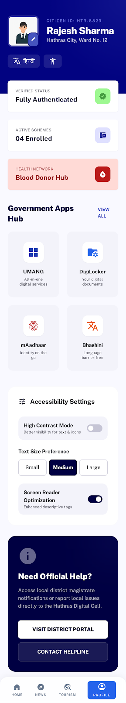
</p>

---

#### 👤 Screen 14: Profile & Apps Hub — AI Hub
> Profile screen with AI chatbot overlay for personalized assistance and app navigation help. *(Phase 2 feature preview)*

<p align="center">
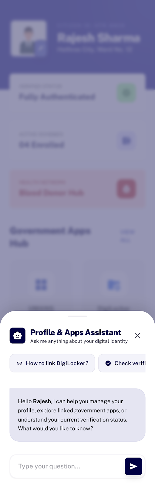
</p>

---

> **Design Summary**: 14 screens covering 7 core modules — each shown in standard view and with AI Hub popup overlay (Phase 2 preview). Designs follow Material Design guidelines with official government color scheme matching hathras.nic.in.

---

## 8. TECHNOLOGY STACK — PHASE 1

### Why Flutter for This Project

| Factor | Flutter | React Native | Kotlin+Swift | PWA |
|--------|---------|-------------|-------------|-----|
| Cross-Platform | ✅ Android + iOS | ✅ Android + iOS | ❌ Separate codebases | ✅ Both |
| Government Projects | ✅ Used by Indian govt apps | ⚠️ Less common | ⚠️ Double cost | ❌ Limited features |
| Performance | ✅ Near-native | ⚠️ Bridge overhead | ✅ Native | ❌ Web-based |
| Offline Support | ✅ Excellent | ✅ Good | ✅ Excellent | ⚠️ Limited |
| Push Notifications | ✅ Firebase/FCM | ✅ Firebase/FCM | ✅ Native | ⚠️ Limited |
| Hindi/RTL Support | ✅ Built-in | ✅ Good | ✅ Good | ✅ Good |
| APK Size | ✅ ~15-20MB | ⚠️ ~25-35MB | ✅ ~10MB | ✅ ~0MB |
| Budget | ✅ Single codebase | ✅ Single codebase | ❌ Double cost | ✅ Cheapest |

### Flutter Wins Because:
1. **Single codebase** — saves 40% cost vs separate Android/iOS
2. **Government adoption** — mPassport Seva, other Indian govt apps use Flutter
3. **Excellent WebView** — seamless redirect to hathras.nic.in pages
4. **Firebase integration** — free push notifications, analytics, crash reporting
5. **Offline-first** with Hive local database
6. **Material Design** — perfect for government-style official UI
7. **Strong Hindi/Unicode** — built into Dart
8. **Direct APK** — for sideloading before Play Store listing

### Phase 1 Complete Tech Stack

| Layer | Technology | Purpose |
|-------|-----------|---------|
| **Mobile App** | Flutter 3.x (Dart) | Cross-platform app framework |
| **State Management** | Riverpod / BLoC | Scalable, testable state |
| **Local Database** | Hive | Offline caching — fast, lightweight |
| **WebView** | flutter_inappwebview | In-app browser for NIC pages |
| **Maps** | Google Maps Flutter Plugin | Directory locations, tourism maps |
| **Push Notifications** | Firebase Cloud Messaging (FCM) | Real-time alerts — free unlimited |
| **Analytics** | Firebase Analytics | Usage tracking — free unlimited |
| **Crash Reporting** | Firebase Crashlytics | Error monitoring — free unlimited |
| **Localization** | flutter_localizations | Hindi/English toggle |
| **Backend API** | Node.js + Express / Firebase Functions | RESTful API server |
| **Database** | Firebase Firestore | NoSQL, real-time sync |
| **File Storage** | Firebase Storage | PDFs, images, documents |
| **Admin Panel** | React.js | Responsive web dashboard |
| **Authentication** | JWT + Firebase Auth | Secure admin access |
| **CDN** | Cloudflare | DNS, SSL, caching — free |
| **CI/CD** | GitHub Actions | Automated builds — free |
